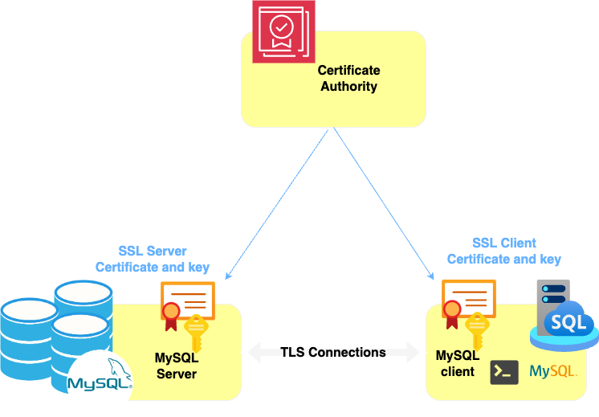

## How to Configure MySQL SSL Connections

Secure communication is critical when managing sensitive data in database management systems. MySQL provides robust support for SSL (Secure Sockets Layer) connections, allowing you to encrypt data transmitted between the MySQL server and clients. This ensures that the information remains confidential and is not vulnerable to interception or tampering during transit.

In this guide, we will walk you through the steps required to configure SSL connections for MySQL, including generating the necessary certificates, modifying the MySQL configuration, and verifying the SSL setup. By the end of this document, you will have a secure MySQL environment that helps protect your data integrity and confidentiality.




This tutorial describes how to configure your server to use SSL for MySQL® database connections. 


### Prerequisites
Before you get started, you’ll need to have these things:

- mysqlshell or mysql client installed
- OpenSSL installed

### Steps

✅ Create the directory to store the SSL keys

To create the directory that will contain the SSL keys.In our container environment, we will create the certificates locally on our host, and then present the directory as a volume to the container.

```bash

:> mkdir ssl
```


✅ Generate SSL Certificates :

You will need to generate SSL certificates for the MySQL server as well as for clients. You can use OpenSSL for this:

```bash

# Run the following commands to create the Certificate Authority (CA) keys: 
openssl genrsa 2048 > ca-key.pem
openssl req -new -x509 -nodes -days 3650 -key ca-key.pem > ca-cert.pem

# Run the following commands to create the server SSL key and certificate: 
openssl req -newkey rsa:2048 -days 3650 -nodes -keyout server-key.pem > server-req.pem
openssl x509 -req -in server-req.pem -days 3650 -CA ca-cert.pem -CAkey ca-key.pem -set_serial 01 > server-cert.pem
openssl rsa -in server-key.pem -out server-key.pem

# Run the following commands to create the client SSL key and certificate: 
openssl req -newkey rsa:2048 -days 3650 -nodes -keyout client-key.pem > client-req.pem
openssl x509 -req -in client-req.pem -days 3650 -CA ca-cert.pem -CAkey ca-key.pem -set_serial 01 > client-cert.pem
openssl rsa -in client-key.pem -out client-key.pem
```

✅ Configure MySQL to Use SSL

Add the following lines to the MySQL configuration file (usually my.cnf):


```toml

[mysqld]
ssl-ca=/etc/my.cnf.d/certs/ca-cert.pem
ssl-cert=/etc/my.cnf.d/certs/server-cert.pem
ssl-key=/etc/my.cnf.d/certs/server-key.pem

[client]
ssl-mode=REQUIRED
ssl-cert=/etc/my.cnf.d/certs/client-cert.pem
ssl-key=/etc/my.cnf.d/certs/client-key.pem

```

Run the following command to update the file permissions of the **ssl** directory and its files: 
```bash
:> chmod 644 *.pem
```

✅ Run MySQL instance

✅ Verify  the remote MySQL connection

Modify your local **my.cnf** configuration file using by mysql client and add the following section:

```toml

[client]
ssl-mode=REQUIRED
ssl-cert=$HOME/ssl/client-cert.pem
ssl-key=$HOME/ssl/client-key.pem

```


Now that our MySQL instance is up,we are going to create a test database and a user with ISSUER and check a SSL connexion.

**Create database:**
```sql

SQL:> CREATE DATABASE IF NOT EXISTS test_db CHARACTER SET utf8mb4 COLLATE utf8mb4_general_ci;

```

**Create user:**
```sql

SQL:> CREATE USER 'tests2'@'%' IDENTIFIED BY 'Bench123'
REQUIRE SUBJECT 'CN=mysqlbu,O=oracle,OU=mysql,L=geneva,ST=GVA,C=CH' 
AND ISSUER '/C=CH/ST=GVA/L=geneva/O=oracle/OU=mysql/CN=mysqlbu';

SQL:> GRANT ALL PRIVILEGES ON test_db.* TO 'tests'@'%' WITH GRANT OPTION;

SQL:> ALTER USER 'tests'@'%' REQUIRE SSL;

````

**Explanation:**

*'CN=mysqlbu,O=oracle,OU=mysql,L=geneva,ST=GVA,C=CH'*  : Corresponds to user certificate details.
*ISSUER '/C=CH/ST=GVA/L=geneva/O=oracle/OU=mysql/CN=mysqlbu'* : Corresponds to sender (mysqlbu) information.


You can check if SSL is enabled by running the following command in the MySQL client:

```sql
SQL:> show variables like 'ssl%'; 
+---------------------------+-------------------------------------+
| Variable_name             | Value                               |
+---------------------------+-------------------------------------+
| ssl_ca                    | /etc/my.cnf.d/certs/ca-cert.pem     |
| ssl_capath                |                                     |
| ssl_cert                  | /etc/my.cnf.d/certs/server-cert.pem |
| ssl_cipher                |                                     |
| ssl_crl                   |                                     |
| ssl_crlpath               |                                     |
| ssl_fips_mode             | OFF                                 |
| ssl_key                   | /etc/my.cnf.d/certs/server-key.pem  |
| ssl_session_cache_mode    | ON                                  |
| ssl_session_cache_timeout | 300                                 |
+---------------------------+-------------------------------------+
:>
````

**Check client connexion  :**
If you're connected via SSL, this will display the encryption currently in use. If you're not connected via SSL, the result will be empty.

```bash
:> mysql -utest -h 10.87.0.3 -p -e "SHOW STATUS LIKE 'Ssl_cipher';"
+---------------+------------------------+
| Variable_name | Value                  |
+---------------+------------------------+
| Ssl_cipher    | TLS_AES_128_GCM_SHA256 |
+---------------+------------------------+
:>
```

The same certificate and key can be used in MySQL client  for your connexion tools like  for Visual Studio Code , Azure Data Studio , DBeaver... and for your applications see the settings of the MySQL Connector you are using.

## Conclusion

In conclusion, establishing a secure connection to a MySQL instance is essential to protect sensitive data from unauthorized access. By following the steps outlined in this document, such as configuring SSL and creating secure users, administrators can enhance the security of their database. It is also crucial to remain vigilant and adopt best practices for managing users and certificates. I encourage you to implement these recommendations and consult additional resources to deepen your understanding of security in MySQL.
It’s possible to use X509 certificates (self-signed or not) to connect to MySQL. With or without a password. 

---

## References

Refer to the official MySQL documentation for more details on configuring SSL and other security aspects:

[MySQL Security.](https://dev.mysql.com/doc/refman/9.0/en/security.html)      
[JDBC Connector](https://dev.mysql.com/doc/connector-j/en/connector-j-reference-configuration-properties.html)   
[MySQL and Encrypted Connections in the manual](https://dev.mysql.com/doc/refman/9.0/en/using-encrypted-connections.html).